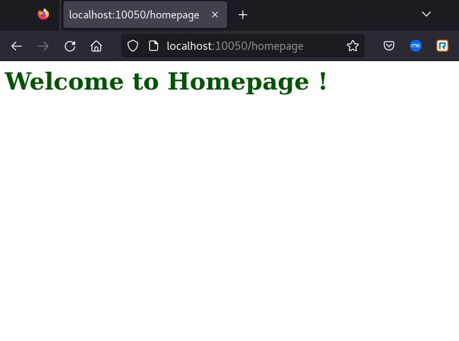
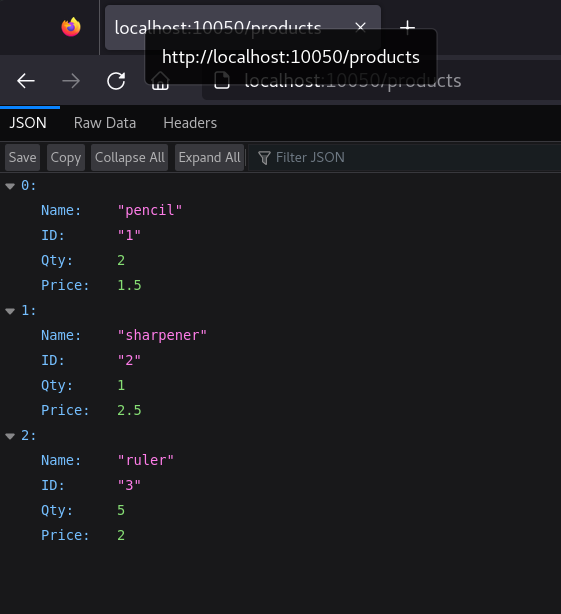
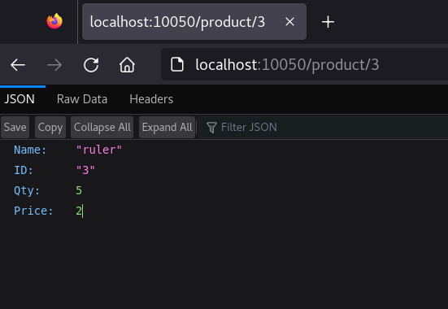

## sre-gig-tasks
SRE Gig Q4 2023 Tasks

### Task3
Build a simple web server in Go. 

#### Steps to Run the Program
1. Start the webserver
`$ go run main.go`

2. Test /homepage endpoint using terminal
```bash
$ curl localhost:10050/homepage
<h1 style='color: #005500'>Welcome to Homepage !</h2>`
```

3. To test the /products endpoint using terminal 
```bash
$ curl localhost:10050/products
[{"Name":"pencil","ID":"1","Qty":2,"Price":1.5},{"Name":"sharpener","ID":"2","Qty":1,"Price":2.5},{"Name":"ruler","ID":"3","Qty":5,"Price":2}]`
```

4. Retrieve a product based on its ID using terminal
```bash
$ curl localhost:10050/product/1
{"Name":"pencil","ID":"1","Qty":2,"Price":1.5}

$ curl localhost:10050/product/2
{"Name":"sharpener","ID":"2","Qty":1,"Price":2.5}
```

5. Alternately, below URLs can also be tested from a browser

|URL|Browser output|Terminal output|
|---|--------------|---------------|
|<http://localhost:10050/homepage>||2023/11/23 14:22:49 Endpoint hit by muxRouter: Homepage|
|<http://localhost:10050/products>||2023/11/23 14:25:34 Endpoint hit: returnProducts|
|<http://localhost:10050/product/3>||2023/11/23 14:26:15 Endpoint hit by muxRouter: getProducts